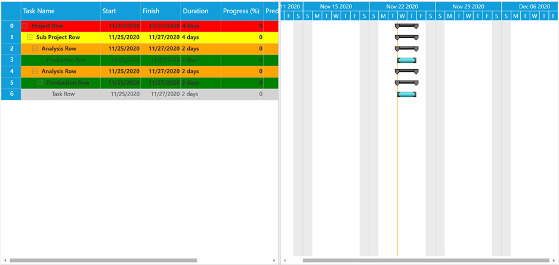

# How-to-customize-the-color-of-specific-group-in-WPF-GanttControl
This article explains how to customize the specific row with various color in the Syncfusion WPF Gantt control as shown in following image.



This can be achieved by considering each node item and update that style through GanttGrid model QueryCellInfo event with follow the below steps.

**Step 1**: Initialize the GanttControl with the needed properties such as ItemsSource and Mapping properties.

[XAML]
```
<gantt:GanttControl x:Name="Gantt"
                    ItemsSource="{Binding TaskDetails}"
                    UseAutoUpdateHierarchy="False"
                    VisualStyle="Metro"
                    Loaded="Gantt_OnLoaded">

    <gantt:GanttControl.TaskAttributeMapping>
        <gantt:TaskAttributeMapping TaskIdMapping="Id"
                                    TaskNameMapping="Name"
                                    StartDateMapping="StDate"
                                    ChildMapping="ChildTask"
                                    FinishDateMapping="EndDate"
                                    DurationMapping="Duration"
                                    ProgressMapping="Complete"
                                    PredecessorMapping="Predecessor"
                                    ResourceInfoMapping="Resource" />
    </gantt:GanttControl.TaskAttributeMapping>
</gantt:GanttControl>

```

**Step 2**: Subscribe the QueryCellInfo of GanttGrid model in Loaded event GanttGrid, since in it only we are updating the color of each row as shown in below

[C#]
```
private void Gantt_OnLoaded(object sender, RoutedEventArgs e)
{
    this.Gantt.GanttGrid.Loaded += GanttGrid_Loaded;
}

private void GanttGrid_Loaded(object sender, RoutedEventArgs e)
{
    this.Gantt.GanttGrid.Model.QueryCellInfo += Model_QueryCellInfo;
    this.Gantt.GanttGrid.InternalGrid.PopulateTree();
    this.Gantt.GanttGrid.InternalGrid.ExpandAllNodes();
}

private void Model_QueryCellInfo(object sender, GridQueryCellInfoEventArgs e)
{
    int nodeindex = this.Gantt.GanttGrid.InternalGrid.ResolveIndexToColumnIndex(e.Style.ColumnIndex);
    if (nodeindex > -1)
    {
        GridTreeNode node = this.Gantt.GanttGrid.InternalGrid.GetNodeAtRowIndex(e.Style.RowIndex);
        if (node != null && node.Item != null)
        {
            Task task = node.Item as Task;
            if (task != null)
            {
                if (task.RowType == RowType.Projectrow)
                {
                    e.Style.Background = new SolidColorBrush(Colors.Red);
                }
                else if (task.RowType == RowType.SubProjectRow)
                {
                    e.Style.Background = new SolidColorBrush(Colors.Yellow);
                }
                else if (task.RowType == RowType.AnalysisRow)
                {
                    e.Style.Background = new SolidColorBrush(Colors.Orange);
                }
                else if (task.RowType == RowType.ProductionRow)
                {
                    e.Style.Background = new SolidColorBrush(Colors.Green);
                }
                else if (task.RowType == RowType.TaskRow)
                {
                    e.Style.Background = new SolidColorBrush(Colors.LightGray);
                }
            }
        }
    }
}
```

**Step 3**: Use case is about changing the color of each row based on its type. To denote that row, add new property like RowType in corresponding model class as per in below

[C#]
```
public enum RowType
{
    Projectrow,
    SubProjectRow,
    AnalysisRow,
    ProductionRow,
    TaskRow
}
```

## See also

[How to import and export the task details in Gantt](https://help.syncfusion.com/wpf/gantt/import-and-export-support)

[How to customize the calendar in Gantt](https://help.syncfusion.com/wpf/gantt/calendar-customization)

[How to get the localization support in Gantt](https://help.syncfusion.com/wpf/gantt/localization)

[How to customize the custom node in Gantt WPF](https://help.syncfusion.com/wpf/gantt/custom-node-style)